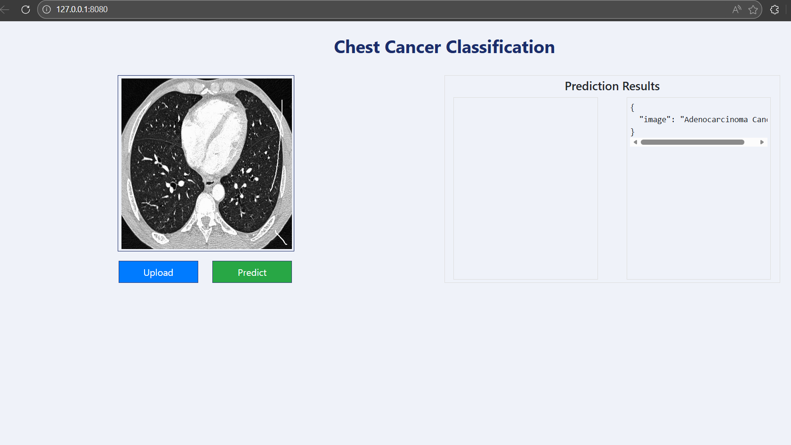

# 🫁 End-to-End Chest Cancer Classification  
### MLflow • DVC • Docker • AWS • GitHub Actions

This project implements a **production-ready deep learning pipeline** for chest cancer image classification using **VGG16 transfer learning**. It covers the complete ML lifecycle including **data ingestion, training, evaluation, experiment tracking, data/model versioning, and automated cloud deployment**.

---

## 🖥️ Application Interface




## 🔁 Project Workflow

1. Update `config.yaml`
2. Update `params.yaml`
3. Define entity classes
4. Update the configuration manager
5. Implement pipeline components
6. Build pipeline stages
7. Update `main.py`
8. Define pipelines in `dvc.yaml`

---

## 📊 MLflow Experiment Tracking

### Run MLflow UI Locally
```bash
mlflow ui


### dagshub
[dagshub](https://dagshub.com/)

MLFLOW_TRACKING_URI=https://dagshub.com/rahulpr7/Chest-Cancer-Classification-Mloops


### DVC cmd

1. dvc init
2. dvc repro
3. dvc dag
```

# AWS-CICD-Deployment-with-Github-Actions 

## 1. Login to AWS console.

## 2. Create IAM user for deployment

	#with specific access

	1. EC2 access : It is virtual machine

	2. ECR: Elastic Container registry to save your docker image in aws


	#Description: About the deployment

	1. Build docker image of the source code

	2. Push your docker image to ECR

	3. Launch Your EC2 

	4. Pull Your image from ECR in EC2

	5. Lauch your docker image in EC2

	#Policy:

	1. AmazonEC2ContainerRegistryFullAccess

	2. AmazonEC2FullAccess

	
## 4. Create EC2 machine (Ubuntu) 

## 5. Open EC2 and Install docker in EC2 Machine:
	
	
	#optinal

	sudo apt-get update -y

	sudo apt-get upgrade
	
	#required

	curl -fsSL https://get.docker.com -o get-docker.sh

	sudo sh get-docker.sh

	sudo usermod -aG docker ubuntu

	newgrp docker
	
## 6. Configure EC2 as self-hosted runner:
    setting>actions>runner>new self hosted runner> choose os> then run command one by one


## 7. Setup github secrets:

    AWS_ACCESS_KEY_ID=

    AWS_SECRET_ACCESS_KEY=

    AWS_REGION = us-east-1

    AWS_ECR_LOGIN_URI = demo>>  566373416292.dkr.ecr.ap-south-1.amazonaws.com

    ECR_REPOSITORY_NAME = simple-app